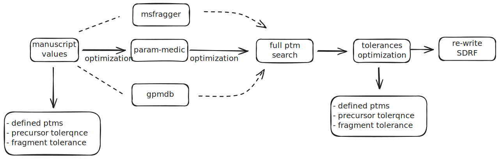

## Parameter optimizations using SAGE

This project aims to optimize the following parameters for a given SDRF annotation: 
- precursor tolerance. 
- fragment tolerance. 
- Post-translation modifications to be considered. 

The tool provides a set of tools and utilities for optimizing each of the parameters.



The parameters optimization tools aim to define the best tolerances (fragment and precursor) and PTMs to be considered when annotating an SDRF to be analyzed with quantms tool. This optimization is needed to get the best results from the quantms workflow data analysis.

### Before optimization

Before optimizing any parameter, you need at least some initial information about your project. For example, the initial precursor tolerances could be obtained from the original authors manuscript or using the [param-medic tool](param_medic.py). The initial PTMs could also be obtained by reading the manuscript or using some predefined ones: 
 - Carbamidomethyl (C) - Fixed - 57.021464
 - Oxidation (M) - Variable - 15.994915

### Using public reanalysis or open search

While the initial tolerances and PTMs could be obtained from the author's manuscript or using the param-medic tool, you can use public reanalyses or open search tools to improve the initial values. How can you do it: 

- **Using gpmdb**: You can use the [gpmdb database](https://gpmdb.thegpm.org/) to search for the dataset of interest. If the dataset is present, you can select any of the models listed for the dataset and select the [given tolerances used by gpmdb](https://gpmdb.thegpm.org/thegpm-cgi/model.pl?path=/gpm/archive/323/GPM32310000436.xml&proex=-1&npep=0&ltype=) and in the list of peptides you can [see the statistics for each PTM](https://gpmdb.thegpm.org/thegpm-cgi/phplctab.pl?path=/gpm/archive/323/GPM32310000436.xml&proex=-1&npep=0&ltype=). 

- **Using FragPipe and MSfragger**: While for some users it will not be possible to use FragPipe because of licenses or other reasons; if it is available for you, you can run the tool with some files from your dataset and using OpenSearch workflow to see the most relevant PTMs in your dataset. The PTM-Shepherd will generate a [report like this](https://github.com/bigbio/multiomics-configs/blob/master/opt-params/PXD000561/PXD000561.global.modsummary.tsv); this report could be use to select (based on the % of PSMs) the most relevant PTMs for your dataset.

### PTMs Optimization

We have developed a Python tool that uses [SAGE tool](https://github.com/lazear/sage) to find out which PTMs are present in your sample according to the search engine. The approach is simple, we created a [sage configuration template](general-sage-ptms-full.json) with the most common PTMs found in public datasets. 

> **Note**: [David L. Tabb et al.](https://doi.org/10.1016/j.ijms.2019.116266) previously suggested a list of common PTMs that should always be included in DDA database search analysis. Other authors have also found multiple PTMs that are consitentively found in public datasets including the [MSFragger team](10.1038/nmeth.4256).
 
The tool searches for all the PTMs with SAGE and provides a statistics about the % of PSMs from the total number of PSMs that are identified for each given PSM. A file report is generated with the name `sage-ptms-report.tsv` that contains the information about the PTMs found in the dataset. In addition, the modifications with more than 1% of the PSMs are printed in the console. Here is the list of PTMs included in the configuration file for full search: 

| PTM                        | Unimod | Mass   | Comments                                                                         |
|----------------------------|--------|--------|----------------------------------------------------------------------------------|
| Carbamidomethyl (C)        | 4      |57.0215 | Common Fixed modification in DDA experiments (PRIDE stats)                       |
| Oxidation (M/P)            | 35     |15.9949 | [Recommended by David L. Tabb et al](https://doi.org/10.1016/j.ijms.2019.116266) |
| Dioxidation (M/P)          | 425    |31.9898 | [Recommended by David L. Tabb et al](https://doi.org/10.1016/j.ijms.2019.116266) |
| Acetyl (Protein N-term)    | 1      |42.0105 | Common Variable modification in DDA experiments (PRIDE stats)                    |
| Deamidation (N/Q)          | 5      |0.9840  | Common Variable modification in DDA experiments (PRIDE stats)                    |
| Gln->pyro-Glu (N-term Q)   | 28     |-17.0265| Common Variable modification in DDA experiments (PRIDE stats)                    |
| Amidated (Protein C-term)  | 2      |-0.9840 | Common Variable modification in DDA experiments (PRIDE stats)                    |
| Formylation (K/C-Term)     | 122    |27.9949 | Common Fixed modification in DDA experiments (PRIDE stats)                       |
| Glu->pyro-Glu (N-term E)   | 27     |-18.0106| Common Variable modification in DDA experiments (PRIDE stats)                    |
| Dimethyl  (K/N-term)       | 36     |28.0313 | [Recommended by David L. Tabb et al](https://doi.org/10.1016/j.ijms.2019.116266) |
| Carbamidomethyl (N-term)   | 4      |57.0215 | [Recommended by David L. Tabb et al](https://doi.org/10.1016/j.ijms.2019.116266) |
| Cation:Fe[III] (D/E)       | 1870   |52.9114 | [Recommended by MsFragger team](https://doi.org/10.1038/nmeth.4256)              |
| Amidation (C-term)         | 3      |-0.9840 | Common Variable modification in DDA experiments (PRIDE stats)                    |
| Methyl (N-term)            | 34     |14.01565| Common Variable modification in DDA experiments (PRIDE stats) |  

 
> **Note**: If you want to suggest a new PTM please open an issue in the repository. In addition, if you have phosphorylation or other biological mods, please add then to the configuration file.

How to edit the sage ptms configuration file:

In the section dedicated to PTMs, feel free to delete or add any PTM mass in the corresponding aminoacid position. 

```json
{
    "static_mods": {
            "C": 57.0215
        },
        "variable_mods": {
            "M": [15.994, 31.9898],
            "P": [15.994, 31.9898],
            "[": [42.0105, 27.9949, 43.0058, 14.01565, 28.0313, 57.0215],
            "]": [-0.9840],
            "N": [0.984],
            "Q": [0.984, -17.02654],
            "K": [27.9949, 43.0058, 14.01565, 28.0313]
        },
}
```
The variable_mods are for the variable modifications and the static_mods are for the fixed modifications.

> **Note**: Please be aware that you should configure the SAGE file if the Carbamidomethyl (C) is not the fixed modification in your dataset.


### Requirements

To run this project, ensure you have the following installed:

```yaml
Python 3.7+
numpy
pandas
matplotlib
click
```

You can install the required Python packages using the following command:

```bash
conda install numpy pandas matplotlib click sage-proteomics
```

Additionally, you can use the enviroment.yaml and create the conda enviroment using the following command: 

```bash
conda env create -f environment.yml
```

### Setup

Clone the repository and navigate to the project directory. Install the required packages:

### Project Structure

```bash
python opt_params.py tolerances --fragment-type ppm --mzml-path /path/to/mzml --initial-fragment-tolerance 20 --initial-precursor-tolerance 20 --min-fragment-tolerance 1 --max-fragment-tolerance 50 --min-precursor-tolerance 10 --max-precursor-tolerance 50 --fasta-file /path/to/fasta --sage-config-file /path/to/sage_config.json --max-iterations 10
```
Parameters: 
- `fragment-type`: The type of fragment tolerance to optimize. Options are `ppm` or `da`.
- `mzml-path`: The path to the mzML files.
- `initial-fragment-tolerance`: The initial fragment tolerance value.
- `initial-precursor-tolerance`: The initial precursor tolerance value.
- `min-fragment-tolerance`: The minimum fragment tolerance value.
- `max-fragment-tolerance`: The maximum fragment tolerance value.
- `min-precursor-tolerance`: The minimum precursor tolerance value.
- `max-precursor-tolerance`: The maximum precursor tolerance value.
- `fasta-file`: The path to the FASTA file.
- `sage-config-file`: The path to the SAGE configuration file.
- `max-iterations`: The maximum number of iterations for the optimization.

```bash
python opt_params.py ptms --mzml-path /path/to/mzml --fasta-file /path/to/fasta --sage-config-file /path/to/sage_config.json
```

Parameters:
- `mzml-path`: The path to the mzML files.
- `fasta-file`: The path to the FASTA file.
- `sage-config-file`: The path to the SAGE configuration file.

